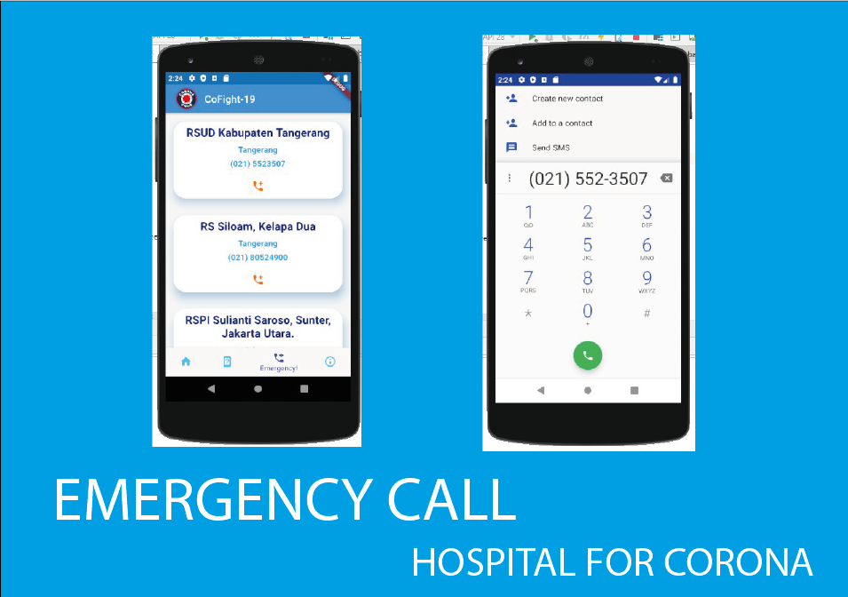

# Cofight-19

Dibuat oleh : Vincent Julindra
NIM : 20175520007
Teknik Informatika
Universitas Matana

## Latar Belakang Aplikasi Cofight-19
Saat ini pandemik Coronavirus merajai dunia, siapa yang tidak ketakutan dengan virus ini? Hingga saat ini masih belum ditemukan vaksin untuk CoronaVirus. Banyak sekali berita Hoax yang beredar di internet yang membuat kepanikan banyak orang. Untuk itu dibuatlah aplikasi Cofight-19 untuk memerangi Virus Corona yang sedang marak ini. Diharapkan dengan aplikasi ini akan membantu orang-orang untuk mendapat informasi terbaru dan akurat mengenai Virus Corona.

## Fitur Cofight-19
## 1. Lengkap dengan 1 Aplikasi
 
## 2. Lengkap dengan 1 aplikasi hingga berita dan poster 
 
## 3. Mudah akses website pemerintah Indonesia mengenai Corona
 
## 4. Dapatkan jawaban terbaik mengenai Corona
 
## 5. Telepon darurat menuju rumah sakit rujukan corona
 
